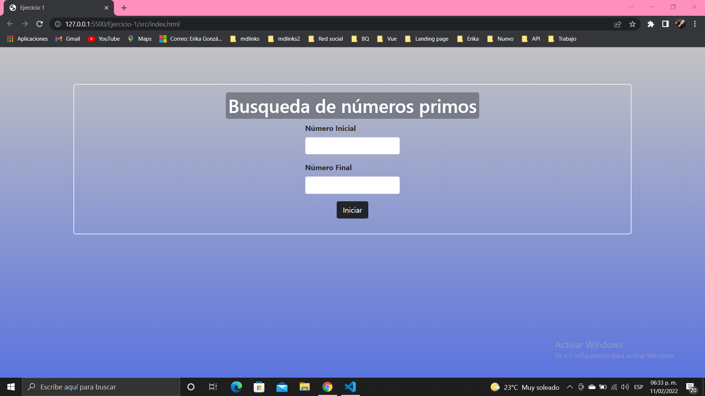
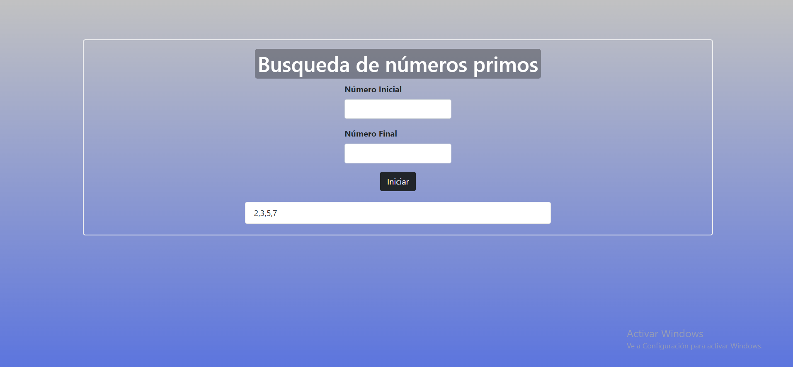
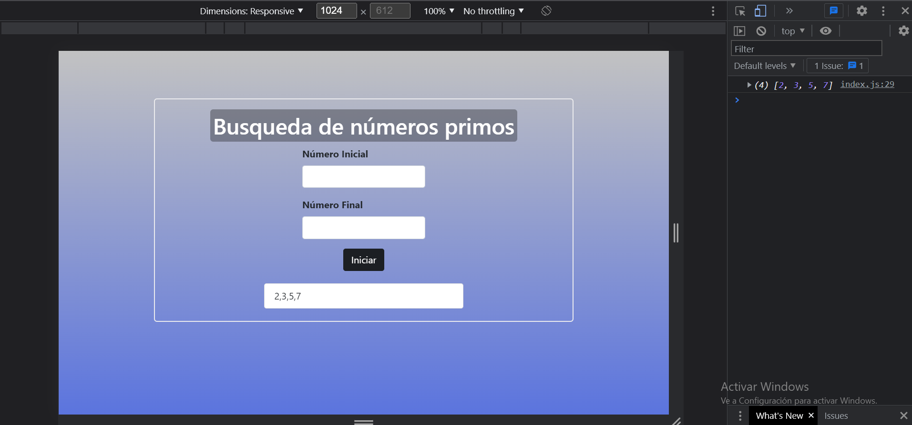
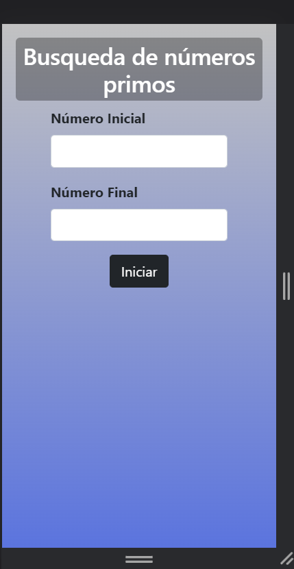
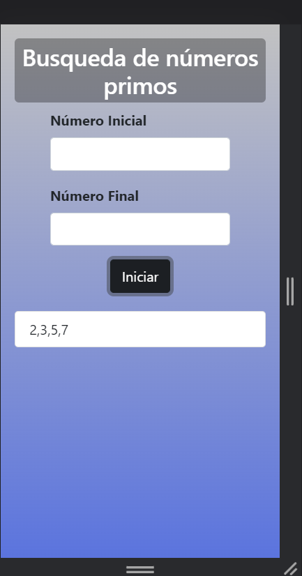

# Números Primos

## Índice

- [1. Resumen del ejercicio](#1-Resumen-del-ejercicio)
- [2. Resultados](#2-Resultados)
- [3. Instalación Local](#3-Instalación-Local)

---

## 1. Resumen del ejercicio

Creación de una pagina web que reciba un rango de números entre A y B y a partir de este rango se muestran en pantalla los números primos.

## 2. Resultados

### Destokp

#### Tambien puede visualizar el resultado en consola:

### Mobile

## 3. Instalación Local

Realizamos un clon del proyecto, por medio de la consola, luego dentro del proyecto ejecutamos Live Server(es un servidor web que se monta en el puerto 5500).

Para descargar Live Serve solo debe dirigirse a las Extensiones de Visual Studio Code.
