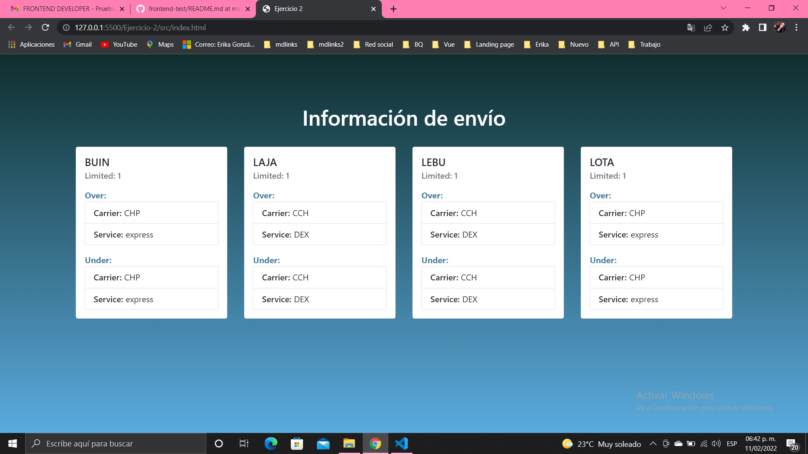
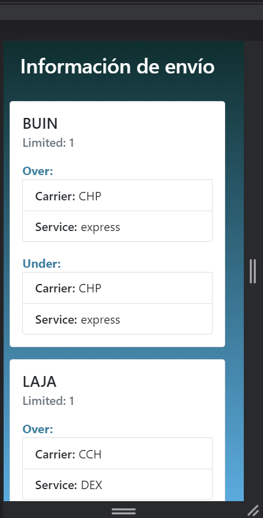
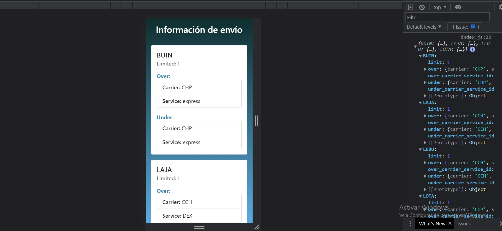

# Números Primos

## Índice

- [1. Resumen del ejercicio](#1-Resumen-del-ejercicio)
- [2. Resultados](#2-Resultados)
- [3. Instalación Local](#3-Instalacion)

---

## 1. Resumen del ejercicio

Creación de una pagina web que muestre los resultados del JSON creado al cruzar datos de 2 JSON ya existentes .

### Resultados

Enlace publicado

#### Destokp

##### Tambien puede visualizar el resultado en consola:

#### Mobile

### Instalación Local

Realizamos un clon del proyecto, por medio de la consola, luego dentro del proyecto ejecutamos Live Server(es un servidor web que se monta en el puerto 5500)

Para descargar Live Serve solo debe dirigirse a las Extensiones de Visual Studio Code
